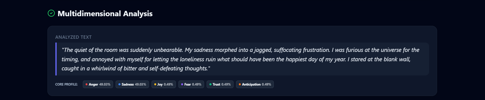

<div align="center">

# 🧠 Emotion Beyond Words

### AI-Powered Emotion Detection using Natural Language Processing

An intelligent web application that analyzes emotions from text using **React**, **FastAPI**, and **Transformer-based NLP models**.

</div>

---

## 📖 Overview

Emotion Beyond Words is an AI-powered web application designed to identify emotions from textual input using Natural Language Processing (NLP). The platform provides real-time emotion prediction, supports bulk analysis through CSV uploads, and presents results in a simple, user-friendly interface.

This project was developed collaboratively as a **team project** and demonstrates the integration of modern frontend technologies with machine learning and backend APIs.

---

## ✨ Features

- 🔍 Real-time emotion prediction from text
- 📂 Bulk emotion analysis using CSV files
- 📊 Interactive visual analytics
- 📥 Export analysis results
- ⚡ FastAPI REST API backend
- 🤖 Transformer-based NLP model
- 🎨 Responsive React user interface

---
## 🛠️ Tech Stack

### Frontend

- React
- Vite
- JavaScript
- HTML5
- CSS3

### Backend

- FastAPI
- Python
- Transformers (Hugging Face)
- PyTorch
- Pandas
- Scikit-learn

### Development Tools

- Git
- GitHub
- VS Code
---

## 📂 Project Structure

```text
emotion-beyond-words
│
├── backend/
│   ├── main.py
│   ├── ml_engine.py
│   └── requirements.txt
│
├── frontend/
│   ├── src/
│   ├── public/
│   └── package.json
│
├── sample_data.csv
├── run.py
├── README.md
└── vercel.json
```
---

## 🚀 Getting Started

### Prerequisites

- Python 3.11+
- Node.js
- npm

### Run the Frontend

```bash
cd frontend
npm install
npm run dev
```

### Run the Backend

```bash
cd backend
pip install -r requirements.txt
python -m uvicorn main:app --reload
```

---
## 👥 Team Project

This project was developed collaboratively as a team project. It demonstrates the integration of modern web technologies with Natural Language Processing (NLP) to analyze emotions from text.

### My Contributions

- Contributed to the development and integration of the application
- Set up and configured the project locally
- Assisted with frontend and backend integration
- Performed testing and debugging
- Improved project documentation and GitHub repository management
---

## 🚀 Future Enhancements

- Improve emotion classification accuracy
- Support multilingual emotion detection
- Add user authentication and history tracking
- Deploy the application for public access
- Enhance data visualization and analytics
---
## 📸 Screenshots

### Home Page


### Emotion Prediction



### Analytics Dashboard


